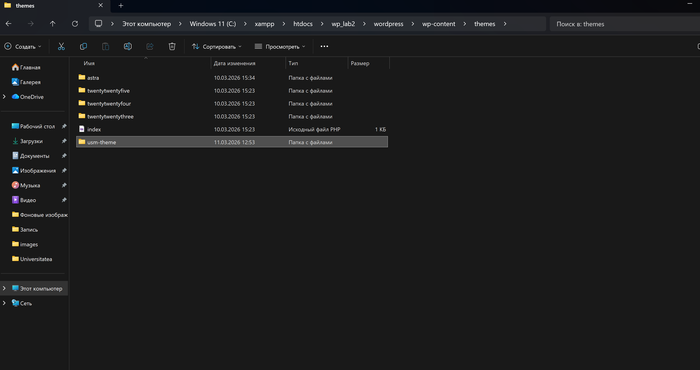

#  Отчёт по лабораторной работе №3 - Разработка простой темы WordPress

**Дисциплина:** Content Management Systems

**Студентка:** Оксана Годорожа

**Дата выполнения:** март 2026

##  Цель работы

Научиться создавать собственную тему WordPress с нуля, разобраться в минимальной структуре темы и принципах работы системы шаблонов **Template Hierarchy**.

---

## Теоретическая часть

### Что такое тема WordPress?

**Тема WordPress** — это набор файлов (PHP, CSS, изображения), определяющих внешний вид и структуру сайта. WordPress использует систему **иерархии шаблонов (Template Hierarchy)** — механизм, по которому CMS автоматически определяет, какой PHP-файл использовать для отображения конкретного типа страницы.

### Обязательные файлы темы

Минимально необходимые файлы для работы темы:

| Файл | Назначение |
|------|-----------|
| `style.css` | Метаданные темы (название, автор, версия) + CSS-стили |
| `index.php` | Главный шаблон — запасной вариант для всего контента |

### Иерархия шаблонов

WordPress ищет шаблоны в следующем порядке:

```
Одиночный пост:   single-{post-type}.php → single.php → index.php
Страница:         page-{slug}.php → page-{id}.php → page.php → index.php
Архив категории:  category-{slug}.php → category.php → archive.php → index.php
```

### Подключение ресурсов

Правильный способ подключения стилей и скриптов — через хук `wp_enqueue_scripts` с использованием функции `wp_enqueue_style()`. Это обеспечивает:
- Корректный порядок загрузки
- Управление зависимостями
- Отсутствие конфликтов с плагинами
- Версионирование файлов

---

## Формулировка задачи

Разработать собственную тему WordPress с именем **`usm-theme`**, включающую:

- Обязательные файлы (`style.css`, `index.php`)
- Общие части шаблонов (`header.php`, `footer.php`, `sidebar.php`)
- Файл функций (`functions.php`)
- Дополнительные шаблоны (`single.php`, `page.php`, `archive.php`, `comments.php`)
- CSS-стилизацию всех основных элементов
- Превью-изображение (`screenshot.png`, 1200×900px)

---

## Практическая часть

### Структура файлов темы

```
wp-content/themes/usm-theme/
│
├  📄 style.css          ← Метаданные + стили темы
├  📄 index.php          ← Главный шаблон (список записей)
├  📄 header.php         ← Шапка сайта
├  📄 footer.php         ← Подвал сайта
├  📄 sidebar.php        ← Боковая панель
├  📄 single.php         ← Одиночный пост
├  📄 page.php           ← Статичная страница
├  📄 archive.php        ← Архив записей
├  📄 comments.php       ← Комментарии
└  📄 functions.php      ← Функции и настройки темы
```

---

### Шаг 1 — Подготовка среды

В локальной установке WordPress перейти в папку `wp-content/themes/` и создать директорию `usm-theme`.


Включить режим отладки в `wp-config.php`:

```php
define('WP_DEBUG', true);
```


---

### Шаг 2 — `style.css` (метаданные + стили)

```css
/*RESET*/
*, *::before, *::after { box-sizing: border-box; margin: 0; padding: 0; }

body {
    font-family: 'Segoe UI', Arial, sans-serif;
    font-size: 16px;
    line-height: 1.7;
    color: #333;
    background: #f5f5f5;
}

a { color: #0073aa; text-decoration: none; }
a:hover { text-decoration: underline; color: #005177; }

/*LAYOUT*/
.site-wrapper  { max-width: 1200px; margin: 0 auto; padding: 0 20px; }
.content-area  { display: flex; gap: 40px; padding: 40px 0; }
.main-content  { flex: 1; min-width: 0; }

/*HEADER*/
.site-header {
    background: #0073aa;
    color: #fff;
    padding: 20px 0;
    box-shadow: 0 2px 6px rgba(0,0,0,.15);
}
.site-header .site-wrapper {
    display: flex;
    justify-content: space-between;
    align-items: center;
}
.site-title a     { color: #fff; font-size: 1.8rem; font-weight: 700; }
.site-description { color: rgba(255,255,255,.8); font-size: .9rem; margin-top: 4px; }

/*NAVIGATION*/
.main-navigation { background: #005b8a; }
.main-navigation ul {
    list-style: none;
    display: flex;
    flex-wrap: wrap;
    max-width: 1200px;
    margin: 0 auto;
    padding: 0 20px;
}
.main-navigation ul li a {
    display: block;
    padding: 12px 18px;
    color: #fff;
    transition: background .2s;
}
.main-navigation ul li a:hover { background: #0073aa; text-decoration: none; }

/*POSTS*/
.post-entry {
    background: #fff;
    border-radius: 6px;
    padding: 30px;
    margin-bottom: 30px;
    box-shadow: 0 1px 4px rgba(0,0,0,.08);
}
.entry-title { font-size: 1.5rem; margin-bottom: 8px; }
.entry-title a { color: #222; }
.entry-title a:hover { color: #0073aa; }
.entry-meta    { font-size: .85rem; color: #777; margin-bottom: 16px; }
.entry-summary { color: #555; margin-bottom: 20px; }
.read-more {
    display: inline-block;
    padding: 8px 20px;
    background: #0073aa;
    color: #fff;
    border-radius: 4px;
    transition: background .2s;
}
.read-more:hover { background: #005b8a; color: #fff; text-decoration: none; }

/*SINGLE POST*/
.single-post-content {
    background: #fff;
    border-radius: 6px;
    padding: 40px;
    box-shadow: 0 1px 4px rgba(0,0,0,.08);
}
.single-post-content h1 { font-size: 2rem; margin-bottom: 10px; }
.entry-content p  { margin-bottom: 1.2em; }
.entry-content h2,
.entry-content h3 { margin: 1.5em 0 .5em; }

/*SIDEBAR*/
.sidebar { width: 300px; flex-shrink: 0; }
.widget {
    background: #fff;
    border-radius: 6px;
    padding: 24px;
    margin-bottom: 24px;
    box-shadow: 0 1px 4px rgba(0,0,0,.08);
}
.widget-title {
    font-size: 1.1rem;
    font-weight: 700;
    margin-bottom: 14px;
    padding-bottom: 8px;
    border-bottom: 2px solid #0073aa;
}
.widget ul         { list-style: none; padding: 0; }
.widget ul li      { padding: 6px 0; border-bottom: 1px solid #f0f0f0; }
.widget ul li:last-child { border-bottom: none; }

/*COMMENTS*/
.comments-area {
    background: #fff;
    border-radius: 6px;
    padding: 30px;
    margin-top: 30px;
    box-shadow: 0 1px 4px rgba(0,0,0,.08);
}
.comments-title  { font-size: 1.3rem; margin-bottom: 20px; }
.comment-list    { list-style: none; padding: 0; }
.comment-body    { border-bottom: 1px solid #eee; padding: 16px 0; }
.comment-author cite { font-weight: 700; }
.comment-metadata    { font-size: .8rem; color: #999; margin-top: 4px; }
.comment-content     { margin-top: 10px; color: #555; }

/*ARCHIVE*/
.archive-header {
    background: #fff;
    border-radius: 6px;
    padding: 24px 30px;
    margin-bottom: 30px;
    box-shadow: 0 1px 4px rgba(0,0,0,.08);
}
.archive-title       { font-size: 1.6rem; color: #0073aa; }
.archive-description { color: #666; margin-top: 6px; }

/*PAGINATION*/
.pagination { display: flex; justify-content: center; gap: 8px; margin: 30px 0; }
.pagination .page-numbers {
    padding: 8px 14px;
    background: #fff;
    border-radius: 4px;
    color: #0073aa;
    box-shadow: 0 1px 3px rgba(0,0,0,.1);
}
.pagination .page-numbers.current,
.pagination .page-numbers:hover {
    background: #0073aa; color: #fff; text-decoration: none;
}

/*FOOTER*/
.site-footer {
    background: #222;
    color: rgba(255,255,255,.75);
    text-align: center;
    padding: 30px 20px;
    font-size: .9rem;
}
.site-footer a { color: #7eb8d4; }

/*NO RESULTS*/
.no-results {
    background: #fff; padding: 40px; border-radius: 6px;
    text-align: center; color: #777;
    box-shadow: 0 1px 4px rgba(0,0,0,.08);
}
```

---

### Шаг 3 — `header.php`

```php
<!DOCTYPE html>
<html <?php language_attributes(); ?>>
<head>
    <meta charset="<?php bloginfo('charset'); ?>">
    <meta name="viewport" content="width=device-width, initial-scale=1.0">
    <title>
        <?php
        if (is_front_page())             { bloginfo('name'); echo ' — '; bloginfo('description'); }
        elseif (is_single() || is_page()) { the_title(); echo ' | '; bloginfo('name'); }
        elseif (is_archive())            { echo get_the_archive_title() . ' | '; bloginfo('name'); }
        else                             { bloginfo('name'); }
        ?>
    </title>
    <?php wp_head(); ?>
</head>
<body <?php body_class(); ?>>
<?php wp_body_open(); ?>

<header class="site-header">
    <div class="site-wrapper">
        <div class="site-branding">
            <p class="site-title">
                <a href="<?php echo esc_url(home_url('/')); ?>">
                    <?php bloginfo('name'); ?>
                </a>
            </p>
            <?php $desc = get_bloginfo('description');
            if ($desc) : ?>
                <p class="site-description"><?php echo esc_html($desc); ?></p>
            <?php endif; ?>
        </div>
    </div>
</header>

<nav class="main-navigation" aria-label="Главное меню">
    <?php wp_nav_menu([
        'theme_location' => 'primary',
        'container'      => false,
        'fallback_cb'    => function() {
            echo '<ul><li><a href="' . esc_url(home_url('/')) . '">Главная</a></li></ul>';
        },
    ]); ?>
</nav>

<div class="site-wrapper">
    <div class="content-area">
        <main class="main-content" id="main" role="main">
```

---

### Шаг 3 — `footer.php`

```php
        </main>

        <?php get_sidebar(); ?>

    </div><!-- .content-area -->
</div><!-- .site-wrapper -->

<footer class="site-footer">
    <div class="site-wrapper">
        <p>
            &copy; <?php echo date('Y'); ?>
            <a href="<?php echo esc_url(home_url('/')); ?>"><?php bloginfo('name'); ?></a>
            — Лабораторная работа №3, Web CMS, USM
        </p>
        <p>Работает на <a href="https://wordpress.org/">WordPress</a></p>
    </div>
</footer>

<?php wp_footer(); ?>
</body>
</html>
```

---

### Шаг 3 — `index.php`

```php
<?php get_header(); ?>

<?php if (have_posts()) : ?>

    <?php while (have_posts()) : the_post(); ?>

        <article id="post-<?php the_ID(); ?>" <?php post_class('post-entry'); ?>>
            <header class="entry-header">
                <h2 class="entry-title">
                    <a href="<?php the_permalink(); ?>"><?php the_title(); ?></a>
                </h2>
                <div class="entry-meta">
                    <?php echo get_the_date(); ?> — <?php the_author(); ?>
                    <?php if (has_category()) : ?> | <?php the_category(', '); ?><?php endif; ?>
                </div>
            </header>
            <div class="entry-summary"><?php the_excerpt(); ?></div>
            <footer class="entry-footer">
                <a href="<?php the_permalink(); ?>" class="read-more">Читать далее &rarr;</a>
            </footer>
        </article>

    <?php endwhile; ?>

    <nav class="pagination">
        <?php the_posts_pagination([
            'mid_size'  => 2,
            'prev_text' => '&laquo; Назад',
            'next_text' => 'Вперёд &raquo;',
        ]); ?>
    </nav>

<?php else : ?>
    <div class="no-results">
        <h2>Записи не найдены</h2>
        <p>Перейдите на <a href="<?php echo esc_url(home_url('/')); ?>">главную страницу</a>.</p>
    </div>
<?php endif; ?>

<?php get_footer(); ?>
```

---

### Шаг 4 — `functions.php`

```php
<?php
if (!defined('ABSPATH')) { exit; }

/**
 * Подключение стилей темы
 */
function usm_theme_enqueue_assets() {
    wp_enqueue_style(
        'usm-theme-style',    // идентификатор
        get_stylesheet_uri(),  // путь к style.css
        [],                    // зависимости
        '1.0.0'               // версия
    );
}
add_action('wp_enqueue_scripts', 'usm_theme_enqueue_assets');

/**
 * Поддерживаемые возможности темы
 */
function usm_theme_setup() {
    add_theme_support('title-tag');
    add_theme_support('post-thumbnails');
    add_theme_support('html5', ['search-form','comment-form','comment-list','gallery','caption']);
    add_theme_support('custom-logo');
    add_theme_support('custom-background', ['default-color' => 'f5f5f5']);
    add_theme_support('post-formats', ['aside','quote','link','image','video']);

    register_nav_menus([
        'primary' => 'Главное меню',
        'footer'  => 'Меню в подвале',
    ]);
}
add_action('after_setup_theme', 'usm_theme_setup');

/**
 * Регистрация области виджетов (sidebar)
 */
function usm_theme_widgets_init() {
    register_sidebar([
        'name'          => 'Основная боковая панель',
        'id'            => 'sidebar-1',
        'before_widget' => '<section id="%1$s" class="widget %2$s">',
        'after_widget'  => '</section>',
        'before_title'  => '<h3 class="widget-title">',
        'after_title'   => '</h3>',
    ]);
}
add_action('widgets_init', 'usm_theme_widgets_init');

/**
 * Кастомная длина выдержки (excerpt)
 */
add_filter('excerpt_length', fn() => 30);
add_filter('excerpt_more',   fn() => '&hellip; <a class="read-more" href="' . get_permalink() . '">Читать далее</a>');
```

---

### Шаг 5 — `single.php`

```php
<?php get_header(); ?>

<?php while (have_posts()) : the_post(); ?>
    <article id="post-<?php the_ID(); ?>" <?php post_class('single-post-content'); ?>>
        <header class="entry-header">
            <h1 class="entry-title"><?php the_title(); ?></h1>
            <div class="entry-meta">
                <?php echo get_the_date(); ?> — <?php the_author(); ?>
                <?php if (has_category()) : ?> | <?php the_category(', '); ?><?php endif; ?>
                <?php if (has_tag()) : ?> | Теги: <?php the_tags('', ', ', ''); ?><?php endif; ?>
            </div>
        </header>
        <?php if (has_post_thumbnail()) : ?>
            <div class="post-thumbnail"><?php the_post_thumbnail('large'); ?></div>
        <?php endif; ?>
        <div class="entry-content"><?php the_content(); ?></div>
    </article>

    <nav class="post-navigation">
        <div class="nav-previous"><?php previous_post_link('%link', '&larr; %title'); ?></div>
        <div class="nav-next"><?php next_post_link('%link', '%title &rarr;'); ?></div>
    </nav>

    <?php if (comments_open() || get_comments_number()) { comments_template(); } ?>
<?php endwhile; ?>

<?php get_footer(); ?>
```

---

### Шаг 5 — `page.php`

```php
<?php get_header(); ?>

<?php while (have_posts()) : the_post(); ?>
    <article id="post-<?php the_ID(); ?>" <?php post_class('single-post-content'); ?>>
        <header class="entry-header">
            <h1 class="entry-title"><?php the_title(); ?></h1>
        </header>
        <?php if (has_post_thumbnail()) : ?>
            <div class="post-thumbnail"><?php the_post_thumbnail('large'); ?></div>
        <?php endif; ?>
        <div class="entry-content"><?php the_content(); ?></div>
    </article>

    <?php if (comments_open() || get_comments_number()) { comments_template(); } ?>
<?php endwhile; ?>

<?php get_footer(); ?>
```

---

### Шаг 5 — `sidebar.php`

```php
<aside class="sidebar" role="complementary">
    <?php if (is_active_sidebar('sidebar-1')) : ?>
        <?php dynamic_sidebar('sidebar-1'); ?>
    <?php else : ?>

        <div class="widget">
            <h3 class="widget-title">Последние записи</h3>
            <?php $q = new WP_Query(['posts_per_page' => 5]);
            if ($q->have_posts()) : ?>
                <ul>
                    <?php while ($q->have_posts()) : $q->the_post(); ?>
                        <li>
                            <a href="<?php the_permalink(); ?>"><?php the_title(); ?></a><br>
                            <small><?php echo get_the_date(); ?></small>
                        </li>
                    <?php endwhile; wp_reset_postdata(); ?>
                </ul>
            <?php endif; ?>
        </div>

        <div class="widget">
            <h3 class="widget-title">Категории</h3>
            <ul><?php wp_list_categories(['show_count' => true, 'title_li' => '']); ?></ul>
        </div>

        <div class="widget">
            <h3 class="widget-title">Архив</h3>
            <ul><?php wp_get_archives(['type' => 'monthly', 'show_post_count' => true]); ?></ul>
        </div>

    <?php endif; ?>
</aside>
```

---

### Шаг 5 — `comments.php`

```php
<?php if (post_password_required()) { return; } ?>

<div id="comments" class="comments-area">

    <?php if (have_comments()) : ?>
        <h2 class="comments-title">
            <?php echo get_comments_number() === '1'
                ? '1 комментарий'
                : get_comments_number() . ' комментариев'; ?>
            к «<?php the_title(); ?>»
        </h2>
        <ol class="comment-list">
            <?php wp_list_comments(['style' => 'ol', 'short_ping' => true]); ?>
        </ol>
        <?php the_comments_navigation(); ?>
    <?php endif; ?>

    <?php if (!comments_open() && get_comments_number()) : ?>
        <p class="no-comments">Комментарии закрыты.</p>
    <?php endif; ?>

    <?php comment_form(['title_reply' => 'Оставить комментарий', 'label_submit' => 'Отправить']); ?>

</div>
```

---

### Шаг 5 — `archive.php`

```php
<?php get_header(); ?>

<header class="archive-header">
    <?php the_archive_title('<h1 class="archive-title">', '</h1>'); ?>
    <?php the_archive_description('<div class="archive-description">', '</div>'); ?>
</header>

<?php if (have_posts()) : ?>
    <?php while (have_posts()) : the_post(); ?>
        <article id="post-<?php the_ID(); ?>" <?php post_class('post-entry'); ?>>
            <header class="entry-header">
                <h2 class="entry-title">
                    <a href="<?php the_permalink(); ?>"><?php the_title(); ?></a>
                </h2>
                <div class="entry-meta"><?php echo get_the_date(); ?> — <?php the_author(); ?></div>
            </header>
            <div class="entry-summary"><?php the_excerpt(); ?></div>
            <a href="<?php the_permalink(); ?>" class="read-more">Читать далее &rarr;</a>
        </article>
    <?php endwhile; ?>
    <nav class="pagination">
        <?php the_posts_pagination(['prev_text' => '&laquo; Назад', 'next_text' => 'Вперёд &raquo;']); ?>
    </nav>
<?php else : ?>
    <div class="no-results"><p>Записи не найдены.</p></div>
<?php endif; ?>

<?php get_footer(); ?>
```

---

## Особенности реализации

### 1. Правильное подключение стилей

В теме используется `wp_enqueue_style()` через хук `wp_enqueue_scripts` вместо прямого тега `<link>`. Это гарантирует корректную работу с плагинами и позволяет управлять версионированием:

```php
wp_enqueue_style('usm-theme-style', get_stylesheet_uri(), [], '1.0.0');
```

### 2. Критические функции `wp_head()` и `wp_footer()`

Функции `wp_head()` в `header.php` и `wp_footer()` в `footer.php` — **обязательны**. Без них WordPress и плагины не могут подключить свои ресурсы. Это одна из наиболее распространённых ошибок начинающих разработчиков.

### 3. Защита `functions.php`

```php
if (!defined('ABSPATH')) { exit; }
```

Предотвращает прямой доступ к файлу через браузер — стандартная практика безопасности WordPress.

### 4. Условные теги

В `header.php` используются условные теги (`is_front_page()`, `is_single()`, `is_archive()`) для динамического формирования заголовка страницы `<title>` — это улучшает SEO и UX.

### 5. `wp_reset_postdata()`

После кастомного `WP_Query` в `sidebar.php` обязательно вызывается `wp_reset_postdata()`, чтобы восстановить глобальную переменную `$post` и не нарушить основной цикл WordPress.


---

## Ответы на контрольные вопросы

---

### 1. Какие два файла являются обязательными для любой темы WordPress?

Обязательными являются файлы **`style.css`** и **`index.php`**.

- **`style.css`** — содержит метаданные темы в специальном CSS-комментарии (Theme Name, Author, Version и т.д.), благодаря которым WordPress распознаёт папку как корректную тему и отображает её в разделе «Внешний вид → Темы».
- **`index.php`** — главный шаблон-запасной вариант. Если WordPress не находит более специфичный шаблон в системе иерархии (например, нет `single.php` или `page.php`), он всегда обращается к `index.php`.

---

### 2. Как подключаются общие части шаблонов (header, footer, sidebar)?

Через встроенные функции-загрузчики WordPress:

| Функция | Подключаемый файл | Запускаемый хук |
|---------|------------------|-----------------|
| `get_header()` | `header.php` | `wp_head` |
| `get_footer()` | `footer.php` | `wp_footer` |
| `get_sidebar()` | `sidebar.php` | — |

Эти функции не просто включают файл — они также запускают соответствующие WordPress-хуки, необходимые для корректной работы плагинов.

Пример использования в `index.php`:
```php
<?php get_header(); ?>
    // ... основной контент ...
<?php get_footer(); ?>
```

---

### 3. Чем отличаются `index.php`, `single.php` и `page.php`?

| Файл | Тип контента | Особенности |
|------|-------------|-------------|
| `index.php` | Любой (запасной шаблон) | Список записей, используется если нет более специфичного файла |
| `single.php` | Одиночная **запись** (post) | Полный текст поста, метаданные, теги, комментарии, навигация пред/след |
| `page.php` | Статичная **страница** (page) | Полный текст страницы, без категорий/тегов, обычно без боковой навигации |

Главное отличие: `single.php` — для динамических публикаций блога (есть автор, дата, категории), `page.php` — для статичных страниц типа «О нас» или «Контакты».

---

### 4. Зачем нужен файл `functions.php` в теме?

`functions.php` — это **файл функций темы**, который WordPress автоматически загружает при каждой инициализации. Он выполняет роль встроенного мини-плагина для темы.

Основные задачи `functions.php`:

| Задача | Функция/Хук |
|--------|------------|
| Подключение стилей и скриптов | `wp_enqueue_style()`, `wp_enqueue_script()` |
| Объявление возможностей темы | `add_theme_support()` |
| Регистрация навигационных меню | `register_nav_menus()` |
| Регистрация областей виджетов | `register_sidebar()` |
| Добавление кастомных функций | Произвольный PHP-код |

Без `functions.php` тема будет работать, но стили не подключатся корректно, меню не зарегистрируются, а виджеты будут недоступны.

---

## Вывод

В ходе лабораторной работы была разработана полноценная тема WordPress **USM Theme** с нуля. Были изучены:

- Минимальная структура темы (`style.css` + `index.php`)
- Система иерархии шаблонов WordPress (Template Hierarchy)
- Принцип разделения шаблонов на общие части (`header`, `footer`, `sidebar`)
- Правильное подключение CSS-стилей через `wp_enqueue_style()`
- Настройка темы через `functions.php` (поддержка заголовков, миниатюр, меню, виджетов)
- Создание специализированных шаблонов (`single.php`, `page.php`, `archive.php`, `comments.php`)

Тема активирована в локальной установке WordPress и корректно отображает все типы контента.

** Репозиторий:** [https://gitlab.usm.md/yourname/usm-theme](https://gitlab.usm.md/)

---

## Список использованных источников

1. WordPress Developer Documentation. *Theme Handbook* — https://developer.wordpress.org/themes/
2. WordPress Developer Documentation. *Template Hierarchy* — https://developer.wordpress.org/themes/basics/template-hierarchy/
3. WordPress Developer Documentation. *wp_enqueue_style()* — https://developer.wordpress.org/reference/functions/wp_enqueue_style/
4. WordPress Developer Documentation. *Required Theme Files* — https://developer.wordpress.org/themes/releasing-your-theme/required-theme-files/
5. SolidWP. *WordPress Theme Development Basics*, 2025 — https://solidwp.com/blog/wordpress-theme-development-basics/
6. Hostinger. *WordPress Template Hierarchy: How Does It Work?* — https://www.hostinger.com/tutorials/wordpress-template-hierarchy
7. PixelNet. *WordPress Enqueue Scripts and Styles: Best Practices 2026* — https://www.pixelnet.in/blog/wordpress-enqueue-scripts-and-styles/
8. Learn WordPress. *Required Theme Files* — https://learn.wordpress.org/lesson/required-theme-files/


