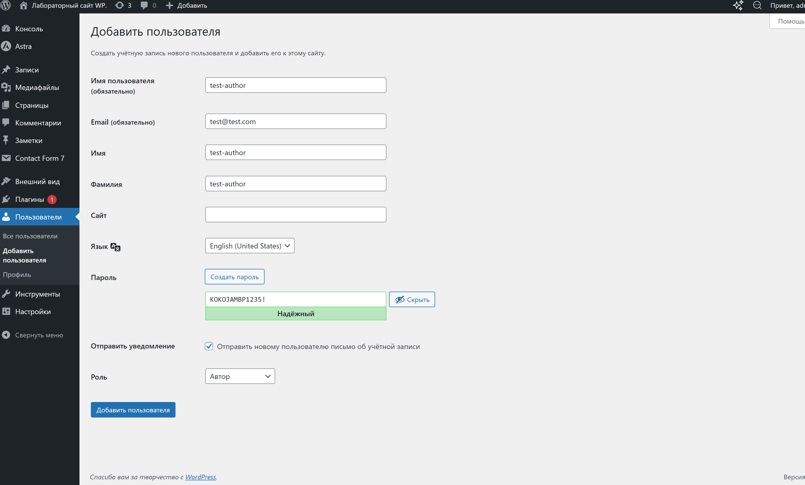
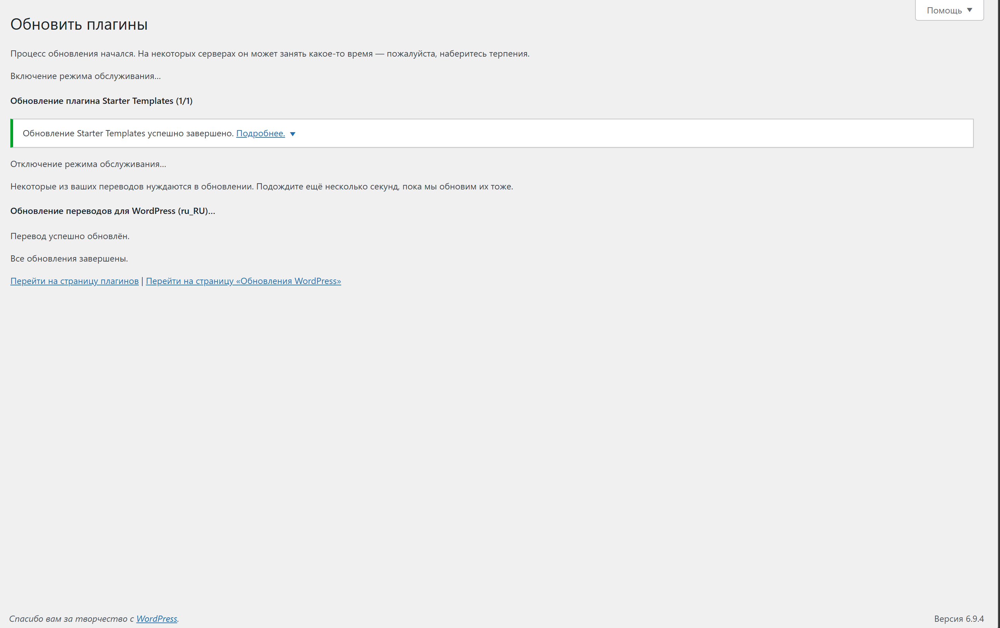
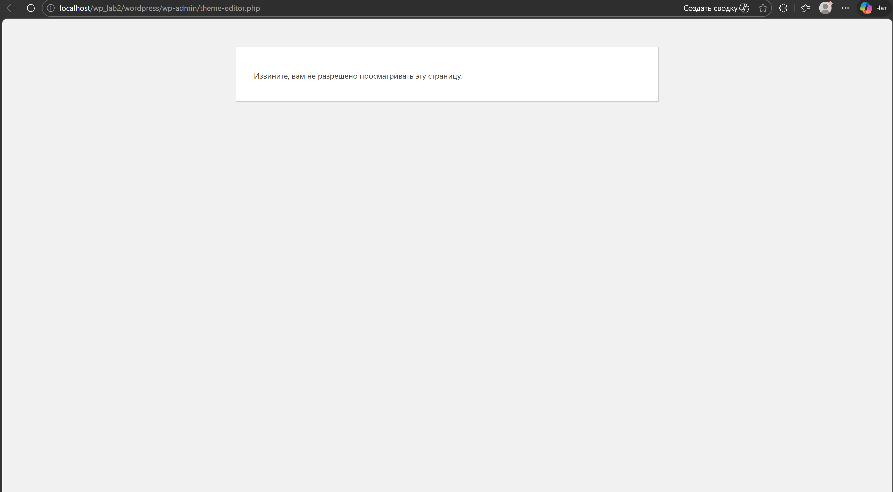
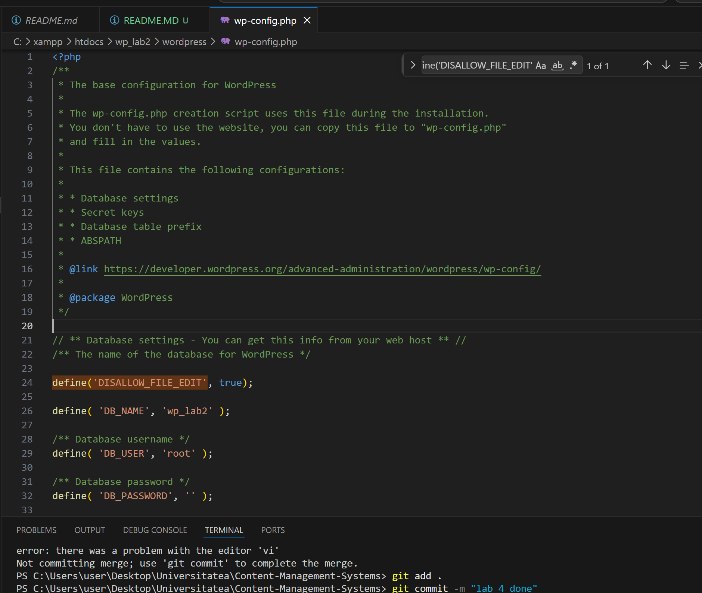
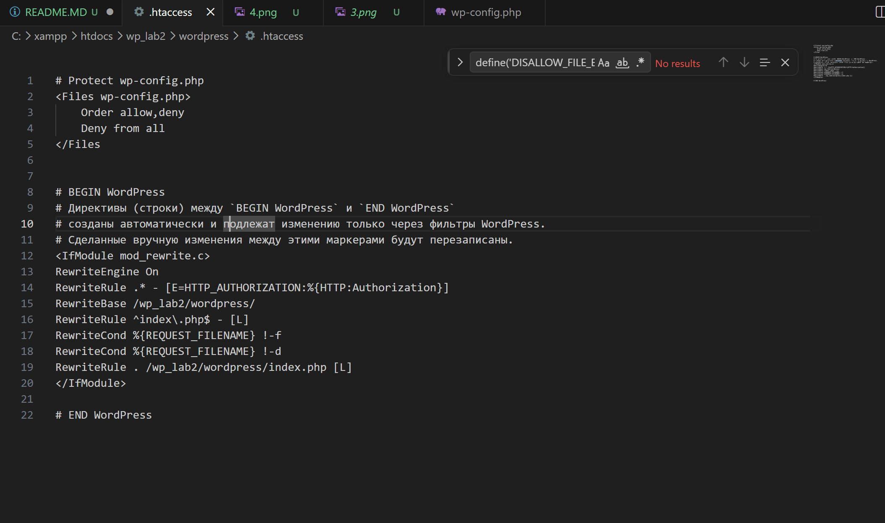
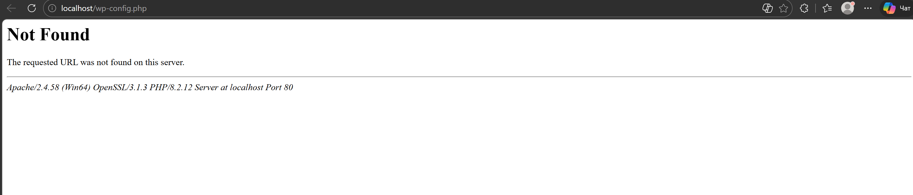
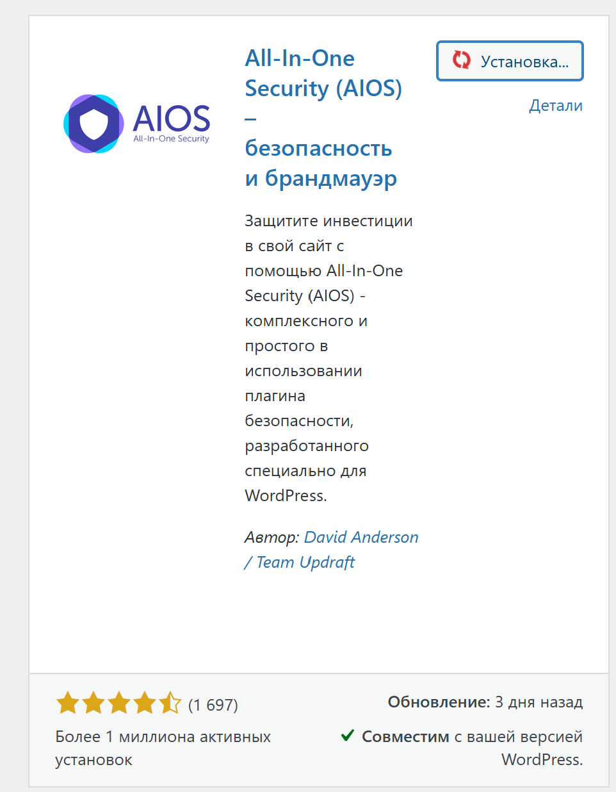
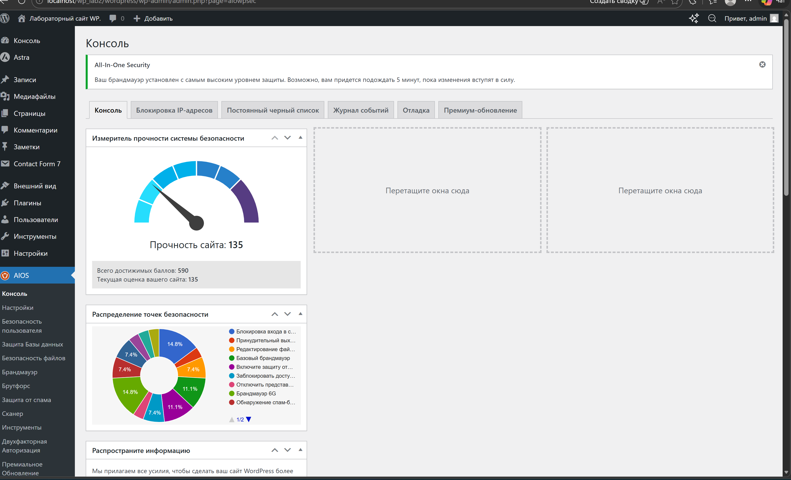
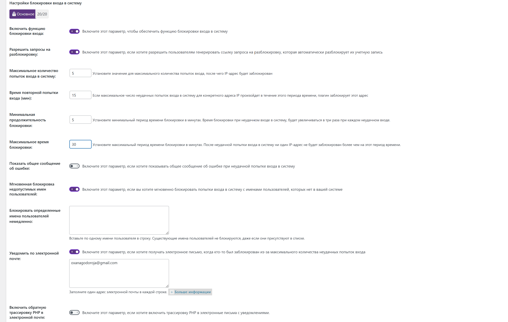

# Лабораторная работа №5 — Безопасность WordPress

## Общая информация

**Тема:** Безопасность WordPress  
**Цель работы:** закрепить ключевые практики безопасности WordPress: управление ролями и паролями, обновления, базовое hardening, резервное коп ребезервное копирование, мониторинг активностиопа мониторинг активности и настройку плагина **All In One WP Security & Firewall (AIOS)**. WordPress рекомендует регулярные обновления, hardening и резервные копии как базовые меры защиты сайта сайтов на этой CMS. [web:152][web:148]

**Формат отчёта:** README.md в репозитории Git. Markdown подходит для структурированного технического отчёта с заголовками, списками и блоками кода. [web:157]

---

## Цель лабораторной работы

В ходе выполнения лабораторной работы необходимо:
- проверить роли пользователей и усилить политику паролей;
- обновить версии ядра WordPress, тем и плагинов;
- выполнить базовое hardening конфигурации сайта;
- установить и настроить **All In One WP Security & Firewall**;
- протестировать защиту от brute force;
- создать резервную копию и проверить восстановление.

AIOS позиционируется как комплексный плагин безопасности WordPress с функциями защиты входа, file change detection, firewall и резервного копирования базы данных. [web:136][web:158]

---

## Использованные инструменты

- **WordPress** — CMS, на которой проводилась настройка безопасности. [web:152]
- **All All In One WP Security & Firewall (AIOS)** — плагин плагин безопасности, включающий login security, lock, firewall-правила и мониторинг изменений файлов. [web:136][web:158]
- **wp-config.php** и **.htaccess** — файлы базовой ручной настройки hardening WordPress. WordPress Handbook рекомендует уделять внимание защите конфигурации и резервным копиям. [web:152][web:148]
- **phpMyAdmin** или средства AIOS — для резервного копирования резервного копирования и последующего восстановления базы данных. AIOS включает функции database backup, а WordPress отдельно подчёркивает важность регулярного backup backup data. [web:136][web:148]

---

## Шаг 1. Подготовка среды

1. Выполнен вход в локальную административную панель WordPress под пользователем с ролью **Administrator**. Для изменения ключевых security settings нужен административный доступ. [web:152]
2. В файле `wp-config.php` включён режим отладки:
   ```php
   define('WP_DEBUG', true);
   ```
3. Для удобства диагностики можно дополнительно включить логирование:
   ```php
   define('WP_DEBUG_LOG', true);
   define('WP_DEBUG_DISPLAY', false);
   ```

Такой вариант позволяет записывать ошибки в лог, не показывая их на экране конечному пользователю. Ограничение лишнего раскрытия информации — часть hardening-практик WordPress. [web:152][web:155]

---

## Шаг 2. Управление ролями и паролями

### 2.1 Создание тестового пользователя

Для дальнейших проверок был создан пользователь с ролью **Автор**.

**Порядок действий:**
1. Открыть **Пользователи → Добавить нового**.
2. Указать логин, email и пароль.
3. Назначить роль **Автор**.
4. Сохранить пользователя.

Разделение ролей позволяет выдавать только минимально необходимые права, а это уменьшает последствия компрометации отдельной учётной записи. Такой подход соответствует принципу минимальных привилегий. [web:152]



### 2.2 Проверка сложности паролей

Для всех администраторов проверены пароли по базовым требованиям:
- длина от 8 символов;
- буквы;
- цифры;
- специальные символы.

Сильные пароли снижают риск brute force и credential stuffing, а AIOS отдельно фокусируется на login security и контроле попыток входа. [web:136][web:159]

---

## Шаг 3. Обновления ядра, тем и плагинов

В разделе **Консоль → Обновления** была выполнена проверка обновлений:
- ядра WordPress;
- активной темы;
- установленных плагинов.

После обнаружения обновлений все компоненты были обновлены до актуальных версий. Регулярные обновления относятся к основным рекомендациям WordPress hardening, поскольку закрывают известные уязвимости и исправляют ошибки безопасности. [web:152][web:154]



### Дополнительно

Для тем и плагинов были включены автоматические обновления там, где это доступно и не конфликтует с локальной учебной средой. Такой подход уменьшает окно уязвимости между выходом исправления и его установкой. [web:152]

### Проверка после обновления

После обновления была выполнена проверка:
- открывается ли админки и сайта;
- работы формы входа;
- отсутствия PHP-ошибок;
- корректной работы плагинов.

Это важно, потому что безопасность должна усиливаться без нарушения базовой работоспособности системы. [web:152]

---

## Шаг 4. Базовое hardening

### 4.1 Отключение редактора файлов

В файл `wp-config.php` добавлена строка:

```php
define('DISALLOW_FILE_EDIT', true);
```

Это отключает встроенный редактор тем и плагинов в админке. WordPress hardening-guide рекомендует ограничивать такие пути пост- post-exploit-изменений, потому что через них злоумышленник с доступом к панели может быстро внедрить вредоносный PHP-код. [web:152]






### 4.2 Права доступа

Были использованы безопасные права:
- **Папки:** `755`
- **Файлы:** `644`

Такие права позволяют владельцу управлять файлами, но не делают систему world-writable, что снижает риск несанкционированной записи. WordPress hardening guidance подчёркивает важность корректных разрешений и минимально необходимых привилегий привилегий на уровне файловой системы. [web:152]

### 4.3 Защита `wp-config.php`

В `.htaccess` добавлено правило:

```apache
<Files wp-config.php>
    Order allow,deny
    Deny from all
</Files>
```

AIOS и hardening-рекомендации также указывают на важность ограничения доступа к `wp-config.php`, поскольку в нём находятся параметры подключения к базе данных и другие чувствительные настройки данные. [web:136][web:152]

Для Apache 2.4 более современный вариант может выглядеть так:

```apache
<Files wp-config.php>
    Require all denied
</Files>
```





### 4.4 Дополнительные меры

Также были проверены:
- отсутствие прав `777`;
- удаление неиспользуемых тем и плагинов;
- сокращение объёма лишних компонентов;
- контроль доступа только для доверенных аккаунтов.

Уменьшение attack surface — одна из типичных целей hardening. [web:152][web:155]

---

## Шаг 5. Установка и первичная настройка All In One WP Security & Firewall

### 5.1 Установка плагина

Плагин установлен через:
**Плагины → Добавить новый → поиск “All In One WP Security & Firewall” → Установить → Активировать**.

AIOS — комплексный security security plugin для WordPress, который включает login функции login security, firewall, file change scanner и защиту чувствительных файлов. [web:136]




### 5.2 User Login → Login Lockdown

В разделе **WP Security → User Login → Login Lockdown** включена защита от brute force.

**Параметры:**
- **Max Login Attempts:** `5`
- **Login Retry Time Period:** `15 minutes`
- **Lockout Time:** `30 minutes`
- **Instantly Lockout Invalid Usernames:** включено
- **Email Notification:** включено

AIOS поддерживает configurable login attempt limits и lockout duration, а аналогичные механизмы login lockdown используют блокировку IP после серии неудачных попыток входа. [web:136][web:162]

**Обоснование выбора:**
- 5 попыток — разумный баланс между безопасностью и удобством;
- окно 15 минут помогает выявить реальную атаку;
- 30 минут lockout заметно удорожают brute force;
- email-уведомления позволяют быстро увидеть инцидент. [web:136][web:156]



### 5.3 User User Login → Force Logout

В AIOS включена функция **Force Logout** со сроком, например, `24 hours`. AIOS описывает эту функцию как способ автоматически завершать пользовательские сессии и снижать риск при оставленных открытыми админках. [web:136][web:158]

**Назначение:** предотвращение “вечных” сессий” сессий, особенно на общих или небезопасных устройствах устройствах.

### 5.4 User Accounts

В разделе **User Accounts** была были проверены учётные записи:
- наличие логина `admin`;
- наличие лишних администраторов;
- соответствие ролей реальным задачам.

AIOS и рекомендации по security подчёркивают, что предсказуемые имена пользователей вроде `admin` облегчают brute force и user enumeration. [web:136][web:158]

### 5.5 User Registration

Если регистрация на сайте открыта, открыта, автоподтверждение было отключено или заменено ручным одобрением. Это уменьшает риск массовой регистрации спам-аккаунтов и нежелательных пользователей. [web:136]

### 5.6 Filesystem Security

В разделе **Filesystem Security** была выполнена проверка прав доступа к файлам и каталогам. AIOS содержит отдельные функции, связанные с проверкой file permissions и защитой чувствительных чувствительных конфигурационных файлов файлов. [web:136]

В рамках лабораторной были подтверждены:
- отсутствие опасных прав `777`;
- соответствие рекомендованным правам `755/644`;
- отсутствие world-writable разрешений.

### 5.7 Firewall

В разделе **Firewall** включены:
- **Basic Firewall Rules**;
- защита от **Bad Query Strings**;
- базовые меры против **XSS**;
- защита от **directory browsing**.

AIOS заявляет поддержку базовых firewall-правил, защиты чувствительных файлов, блокировки debug.log и запрета directory listing на Apache-серверах. [web:136]

**Почему базовый уровень:** он даёт разумную стартовую защиту с меньшим риском ложных срабатываний и поломки учебного сайта. [web:136]

### 5.8 Brute Force → Rename Login Page

Включена функция **Rename Login Page** и установлен нестандартный URL входа, например:

```text
/login-usm-security
```

Скрытие стандартного `wp-login.php` не заменяет полноценную защиту, но уменьшает объём автоматизированных ботов, бьющих по типовым адресам входа. При этом новый URL нужно сохранить отдельно, иначе можно потерять доступ к админке. AIOS и support-материалы отдельно предупреждают об этом риске. [web:136][web:143]

### 5.9 Scanner / Malware

Включён **file change detection** с email-уведомлениями. AIOS описывает file change scanner как способ уведомлять об изменениях в системе и быстрее замечать подозрительную активность. [web:136]

### 5.10 Backup

В разделе **Database** создана резервная копия базы данных. WordPress рекомендует регулярно выполнять data backups и контролировать целостность backup files. [web:148][web:152]

### 5.11 Notifications

Включены email-уведомления для:
- lockout;
- изменения файлов;
- событий, связанных с администраторами;
- других доступных security notifications.

Уведомления сокращают время обнаружения инцидента и помогают быстрее реагировать на подозрительные события. [web:136][web:159]

---

## Шаг 6. Проверка защиты от brute force

Для теста использован тестовый пользователь с ролью **Автор**.

### Порядок выполнения

1. Выполнен выход из админки или открыт режим инкогнито.
2. Использован новый URL входа.
3. 5–6 раз подряд введён неправильный пароль.
4. Проверено срабатывание блокировки.
5. В разделе **WP Security → Dashboard / Logs** просмотрена запись о lockout.

Login lockdown-механизм работает за счёт отслеживания количества неудачных попыток входа и временной блокировки после превышения лимита. Такой подход считается базовой защитой от brute force атак. [web:156][web:162]


### Ожидаемый результат

- IP или пользователь блокируется;
- запись о событии появляется в логах;
- при необходимости IP можно разблокировать вручную.

AIOS и login lockdown-подходы именно так и построены: лимит попыток, окно времени и duration blockировки. [web:136][web:162]

---

## Шаг 7. Восстановление из резервной копии

### Выполненные действия

1. Удалена тестовая запись.
2. Удалено одно изображение.
3. Выполнено восстановление из резервной копии.

### Что важно понимать

Если создан только только **бэкап базы данных**, то можно восстановить:
- записи и страницы;
- пользователей;
- настройки;
- связи записей с медиа.

Но физический файл изображения из `wp-content/uploads/` не всегда вернётся только из SQL-дампа. WordPress прямо рекомендует резервировать не только базу данных, но и файлы сайта, потому что data backups должны включать полный набор критически важных данных. [web:148][web:152]

### Что нужно включать в полный бэкап

Полный backup WordPress должен включать:
- базу данных;
- `wp-content/uploads/`;
- тему;
- плагины;
- кастомные конфигурационные файлы при необходимости.

WordPress handbook по резервным копиям подчёркивает регулярность backup и контроль целостности данных. [web:148][web:152]

### Проверка восстановления

После восстановления необходимо проверить:
- вернулась ли тестовая запись;
- отображается ли изображение в медиатеке и физически в `uploads`;
- работают ли страницы и плагины;
- сохраняется ли доступ в админку.

Надёжным считается не просто существующий архив, а реально проверенное восстановление. [web:148]

---

## Ответы на контрольные вопросы

### 1. Почему `DISALLOW_FILE_EDIT` и правильные права на `wp-config.php` уменьшают риск post-exploit?

`DISALLOW_FILE_EDIT` отключает встроенный редактор тем и плагинов в админке, поэтому злоумышленник, получивший доступ к панели управления, не сможет сразу внедрить вредоносный PHP-код через интерфейс WordPress. Это уменьшает риск закрепления после компрометации аккаунта. [web:152]

`wp-config.php` хранит параметры базы данных и другие чувствительные конфигура чувствительные настройки, поэтому широкий доступ к этому файлу опасен. Ограничение доступа через права файловой системы и правила веб-сервера уменьшает последствия уже произошедшего взлома. [web:136][web:152]

### 2. Какие параметры Login Lockdown и Firewall были выбраны и почему?

Были были выбраны следующие параметры Login Lockdown:
- `Max Login Attempts = 5`
- `Login Retry Time Period = 15 минут`
- `Lockout Time = 30 минут`
- блокировка несуных логинов
- email-уведомления

Такая конфигурация даёт баланс между безопасностью и UX: случайная ошибка пользователя не приводит сразу к блокировке, но автоматический перебор быстро становится неэффективным. AIOS поддерживает именно такие configurable параметры для login security. [web:136][web:158]

Для firewall был выбран базовый уровень с Bad Query Strings, XSS и защитой от directory browsing, потому что он даёт минимально необходимую защиту без избыточной агрессии к легитимным запросам. AIOS описывает Basic Firewall как стартовую, практичную защиту для WordPress-сайтов. [web:136]

### 3. Чем отличаются меры защиты на уровне WordPress от мер на уровне веб-сервера и ОС?

Меры на уровне **WordPress** работают внутри самой CMS: роли, политики паролей, плагины безопасности, ограничение login attempts, monitoring и application-level firewall. AIOS относится именно к этому уровню. [web:136][web:158]

Меры на уровне **веб-сервера** работают до выполнения PHP-кода WordPress: правила Apache/Nginx, ограничение доступа к ` файлам, защита `wp-config.php>`, rate limiting, directory listing control и security headers. Hardening WordPress дополняет, но не заменяет эти меры. [web:152]

Меры на уровне **ОС** защищают всю среду выполнения: права Linux-пользователей, firewall ОС, обновления пакетов, изоляцию процессов и контроль SSH-доступа. Многоуровневая защита считается наиболее устойчивым подходом. [web:152]

### 4. Что обязательно включать в полный бэкап WordPress и как проверять восстановление?

Полный backup WordPress должен включать:
- базу данных;
- `wp-content/uploads/`;
- темы;
- плагины;
- критичные конфигурационные файлы.

WordPress подчёркивает, что data backups нужно делать регулярно и проверять их integrity, а не просто хранить архив. [web:148][web:152]

Проверка восстановления должна быть практической:
- восстановить сайт в тестовой среде;
- проверить записи и пользователей;
- проверить наличие изображений;
- убедиться, что сайт открывается и админка работает.

Если backup есть, но из него нельзя восстанов восстановить сайт, такой backup нельзя считать надёжным. [web:148]

---

## Скриншоты для отчёта

В README или PDF-отчёт рекомендуется включить:
1. Админ-панель WordPress.
2. Список пользователей и тестового пользователя с ролью Автор.
3. Страницу обновлений WordPress.
4. `wp-config.php` с `DISALLOW_FILE_EDIT`.
5. Настройки AIOS → Login Lockdown.
6. Настройки Rename Login Page.
7. Логи срабатывания блокировки.
8. Создание резервной копии.
9. Результат восстановления.

Скриншоты ключевых этапов прямо указаны как требование отчёта в условии, а Markdown-структура позволяет удобно оформить такую документацию. [web:157]

---

## Инструкции по запуску и проверке

1. Установить локальный WordPress.
2. Войти в админку под администратором.
3. Включить `WP WP_DEBUG` в `wp-config.php`.
4. Создать тестового пользователя Автор.
5. Обновить WordPress, темы и плагины.
6. Добавить `DISALLOW_FILE_EDIT`.
7. Проверить права `755/644`.
8. Установить и активировать **All In One WP Security & Firewall**.
9. Настроить Login Login Lockdown`, `Force Logout`, `Firewall`, `Rename Login Page`, `File Change Detection`, `Backup`.
10. Протестировать brute force-блокировку.
11. Создать резервную копию и проверить восстановление.

---

## Список использованных источников

1. WordPress Developer Handbook — Hardening WordPress: https://developer.wordpress.org/advanced-administration/security/hardening/ [web:152]  
2. WordPress Developer Handbook — Backups: https://developer.wordpress.org/advanced-administration/security/backup/ [web:148]  
3. WordPress.org — All-In-One Security (AIOS): https://wordpress.org/plugins/all-in-one-wp-security-and-firewall/ [web:136]  
4. AIOS plugin code / constants overview: https://github.com/Arsenal21/all-in-one-wordpress-security/blob/master/all-in-one-wp-security/wp-security-core.php [web:153]  
5. Login Lockdown explanation: https://wordpress.org/plugins/login-lockdown/ [web:162]  
6. Supplemental AIOS setup note: https://cantrusthosting.coop/knowledge-base/wordpress/plugins/required-plugins/all-in-one-wp-security-firewall/ [web:164]

---

## Примечание

Если преподаватель требует PDF-версию, этот этот README можно использовать использовать как основу, а затем перенести в Word или Google Docs с соблюдением параметров оформления: Times New Roman Roman 12 pt` для основного текста, `14 pt` для для основных заголовков, нумерацией страниц и подписями к рисункам и таблицам.